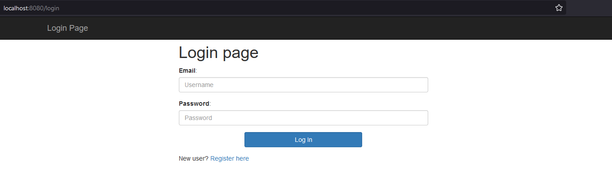
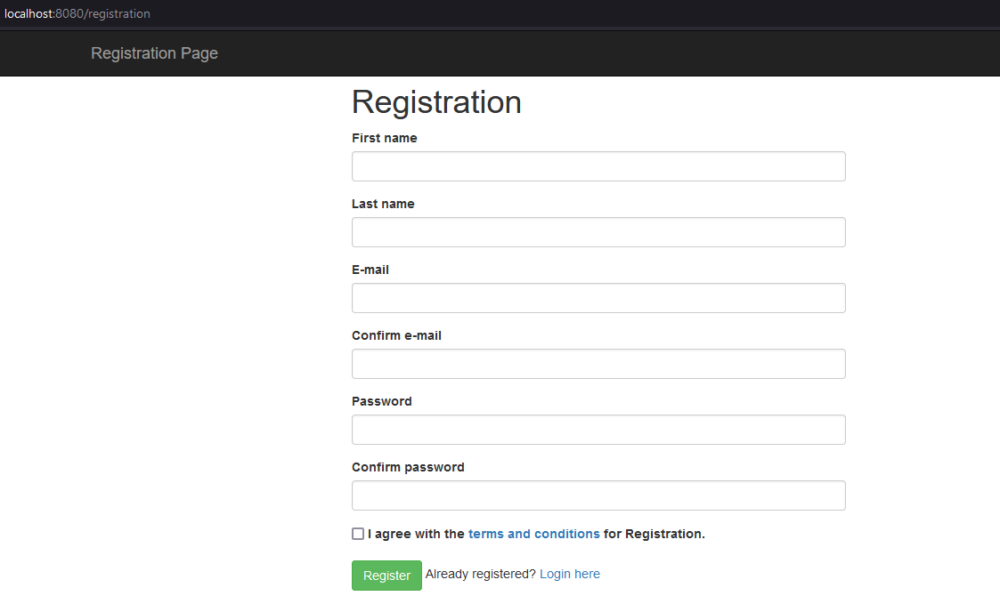
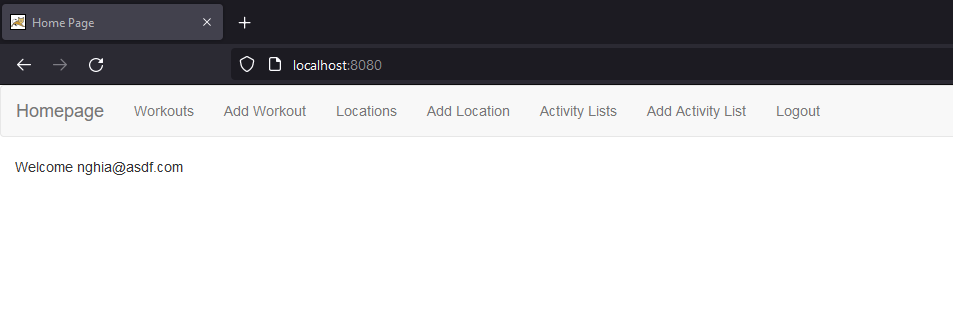
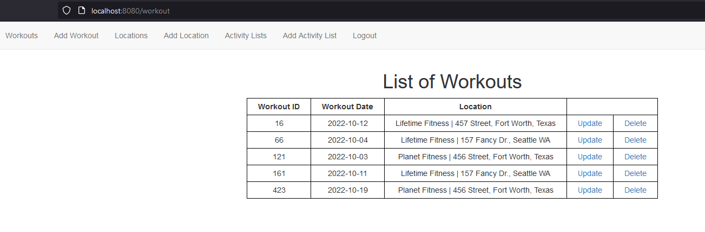
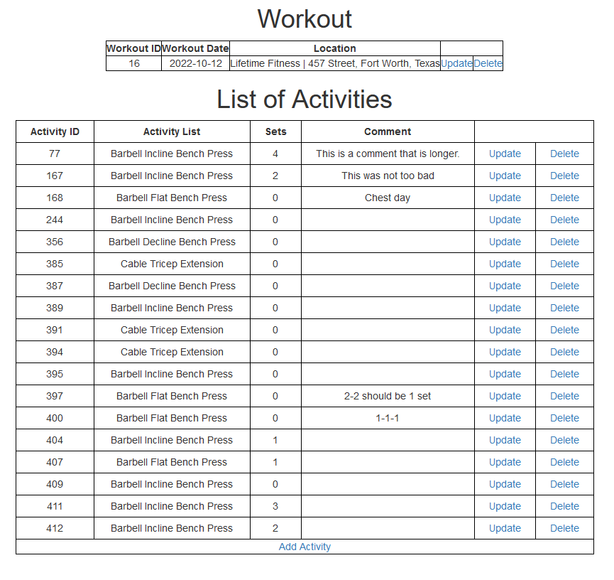
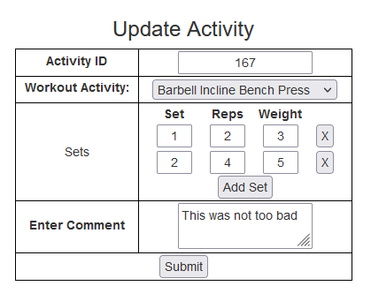

# FitnessTracker
Case Study for PerScholas 

This application is a Fitness Tracker that allows you to track your workouts, which includes: the activity and muscle groups worked out, how many reps and weights you did, what location you worked out at and even comments about how you felt about the workout activity.

# Technologies & Languages: 
Java, JavaScript, Spring Boot, Thymeleaf, Spring Boot MVC, Bootstrap, SQL, Hibernate, Spring Security, Spring Data JPA, JQuery.

# General Flow
You're first brought to a login page:

Where if you haven't signed up for an account yet you can go register one by clicking "Register here". Then you can add in your account information. There's field matching between the two password fields and the two email fields.

After logging in you're brought to a home page:

At the top you can see a navigation bar where you can peruse your workouts, locations, activity lists, etc.

If you click "Workouts" you'll reach a page where you can see a list of the workouts you've added and logged:

And then if you click on a single workout you'll bring up the list of activities associated with it:

You can either add or update activities here, or even update or delete the workout itself. Here's what updating an activity would look like:

Which includes Sets you can add or remove, list of exercises to choose from and a comment section. 